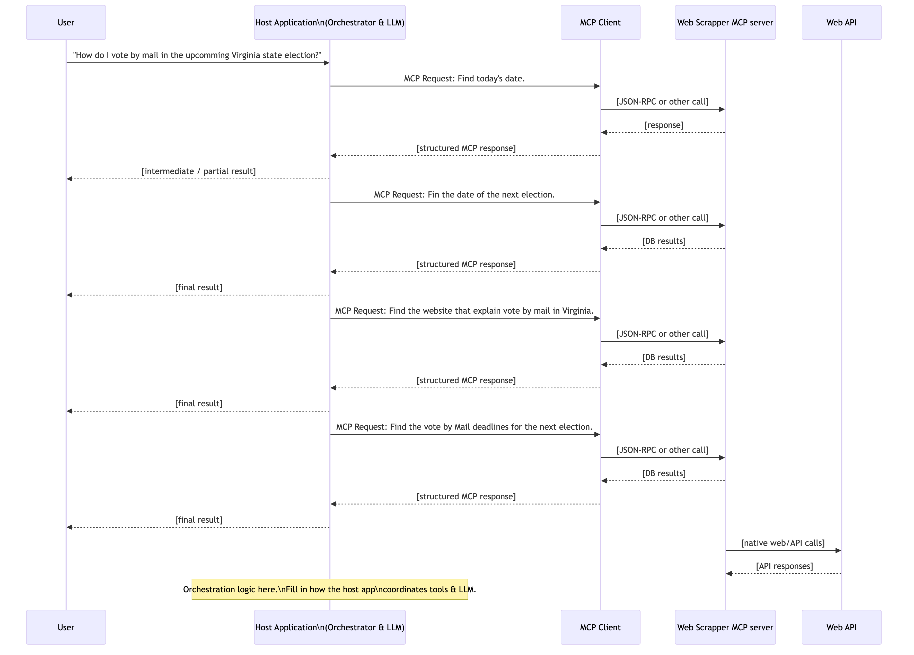

# Voting Info Agent

Status: Planning & design only — implementation work has not started.

## Overview
Voting Info Agent is an MCP (Model Context Protocol) agent that will guide voters through the logistics of participating in U.S. state and federal elections. The agent will run on OpenAI’s `gpt-5.1` model and orchestrate a collection of data-enrichment tools to answer practical questions such as where to vote, when polling locations are open, and how to request absentee ballots.

## Objectives
- Provide accurate, timely election logistics tailored to a voter’s location.
- Support on‑demand answers for election-day, early in-person, and mail-in voting.
- Serve as a centralized planning document for data sources, tooling, and schema requirements ahead of implementation.

## Planned Capabilities
- Return the nearest polling location for a given address or district.
- Provide election-day dates and polling hours.
- Explain early in-person voting steps, locations, dates, and operating hours.
- Explain how to request, submit, and track mail-in ballots, including critical deadlines.
- Infer a user’s state, district, or precinct from their address.
- Determine the current date and the next relevant election for a jurisdiction.

## Tooling & Integrations
| Tool | Purpose | Notes |
| --- | --- | --- |
| `get_current_date()` | Canonical source of “today” for deadline calculations. | Wrapper around system or trusted API time. |
| `get_district_from_address()` | Maps an address to state + district/precinct. | Likely aggregates multiple state APIs or commercial geocoding data to stay current. |
| `get_nearest_election()` | Returns a structured `Election` object (see schema below). | Needs per-state election feeds and fallback heuristics. |
| `get_contence_from_url()` | Scrapes official state guidance for a specific voting method. | Signature: `(state, election_date, type_of_voting)` where `type_of_voting ∈ {election_day, early_in_person, mail_in_ballot}`. |
| `find_nearest_polling_location()` | Finds the closest polling place for an address/district on a given date. | Prefer official endpoints; fallback to GIS distance checks (e.g., Google Maps API). |
| `websearch()` | High-recall lookup for novel or fast-changing requirements. | Executes an OpenAI call with web search enabled and returns the best URL + summary. |

## Data Model (Draft)
`Election`
- `state`
- `district_or_precinct`
- `most_common_time_zone`
- `date_election_day`
- `early_voting_start`
- `early_voting_end`
- `mail_ballot_request_deadline`
- `mail_ballot_send_deadline`
- `mail_ballot_received_deadline`
- `races: List[Race]`
- `ballot_questions: List[BallotQuestion]`

`Race`
- `name`
- `candidates: List[Candidate]`

`Candidate`
- `name`
- `party`

`BallotQuestion`
- `question_text`
- `answers: List[str]` (yes/no or other state-specific responses)

## Open Questions
- Which authoritative APIs provide per-state polling locations and early voting sites?
- How often do district boundaries change, and what cadence is required to refresh cached data?
- What level of geocoding accuracy is necessary to handle apartment complexes or rural routes?
- How should the agent communicate uncertainty when state data conflicts or is unavailable?

## Roadmap (High Level)
1. Validate available data sources for districts, elections, and polling locations.
2. Finalize the contract for each MCP tool (inputs, outputs, error semantics).
3. Implement the data model and persistence strategy for elections and ballot content.
4. Build and test individual tools, starting with `get_current_date` → `get_district_from_address` → `get_nearest_election`.
5. Integrate tools into the MCP agent and add guardrails for stale or conflicting data.
6. Pilot against a small subset of states before expanding nationwide coverage.

## Diagrams
See `./diagrams/mcp_sequence_template_20251119_095524.png` for the current MCP sequence concept.

